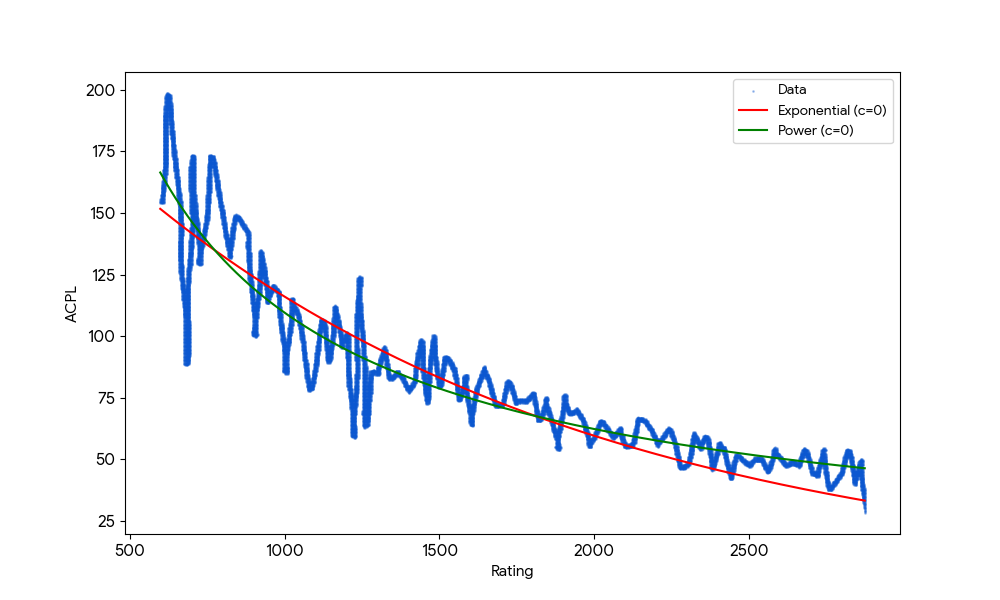

# ♟️ Adaptive Chess Bot

**Play chess against a computer that adapts to your skill level!**

This is a fun, beginner-friendly chess app that:
- 🎯 **Learns how strong you are** as you play
- 🤖 **Adjusts difficulty** so you're always challenged but not overwhelmed
- 📊 **Shows your progress** with easy-to-read charts
- 🏠 **Runs entirely on your computer** — no internet needed!

---

## 🚀 Quick Start

### Option 1: Using Docker (Recommended — Works on Any Computer!)

If you have [Docker Desktop](https://www.docker.com/products/docker-desktop/) installed:

```bash
docker-compose up --build
```

Then open your browser to: **http://localhost:8501**

That's it! You're ready to play! ♟️

### Option 2: Running Locally (Without Docker)

1. Make sure you have Python 3.10+ installed
2. Open a terminal in this folder and run:
   ```
   pip install -r requirements.txt
   ```
3. Run the app:
   ```
   ./run_app.ps1
   ```
   Or manually in two separate terminals:
   ```
   uvicorn src.api:app --reload
   ```
   ```
   set CHESSBOT_API_URL=http://127.0.0.1:8000
   streamlit run src/app.py
   ```

---

## 🎮 How to Play

### Step 1: Start a Game
1. Open the app in your browser (http://localhost:8501)
2. In the sidebar, you'll see "Session ID" — just leave it as "demo" or type any name
3. Click **"New Session"** to start!

### Step 2: Make Your Move
- You play as **White** (you move first!)
- Look at the board and decide your move
- **Need help?** Click "Show Legal Moves" in the sidebar to see all possible moves
- Type your move in the box (like `e2e4` to move a pawn from e2 to e4)
- Click **"Make Move"**

### Step 3: Watch the Bot Respond
- The bot automatically plays its move right after yours
- No waiting, no clicking extra buttons!

### Step 4: Track Your Progress
- Look at the **right side** of the screen to see your performance chart
- Check the sidebar for your **Estimated ELO** rating and **Avg Centipawn Loss**
- The lower your centipawn loss, the better you're playing!

---

## 📖 Understanding the Numbers

Don't worry if you're new to chess or these terms seem confusing! Here's a simple guide:

### What is "Centipawn Loss"?
Think of it like a "mistake meter":
- **0** = Perfect move! 🌟
- **50** = Small inaccuracy
- **100+** = Bigger mistake

The app measures this for every move you make. Lower is better!

### What is "Average Centipawn Loss" (ACPL)?
Your average mistake size across all moves:
- **Under 25**: You're playing like a grandmaster! 🏆
- **25-50**: Very strong play
- **50-100**: Good club player
- **Over 100**: Room to improve!

### What is "ELO Rating"?
It's a number that shows how strong a chess player is:
- **400-800**: Just starting out 🌱
- **800-1200**: Casual player
- **1200-1600**: Club player ♟️
- **1600-2000**: Strong amateur
- **2000+**: Expert level 🌟

The app estimates your ELO based on how you play!

### What is "Bot Depth"?
This is how "smart" the computer opponent is:
- **Depth 1**: Easy (thinks 1 move ahead)
- **Depth 8**: Very hard (thinks 8 moves ahead)

**The cool part:** The bot automatically adjusts to match YOUR skill level!

---

## 🔬 The Science Behind It

### How ELO is Estimated

Your ELO is calculated using a mathematical formula based on your Average Centipawn Loss:

```
ELO = 323422 × (ACPL ^ -1.2305)
```

This "power-law" formula was derived from analyzing real chess games. Here's what it means:

| Your ACPL | Estimated ELO | What it means |
|-----------|---------------|---------------|
| 25 | ~2800 | World Champion level |
| 50 | ~2100 | Expert player |
| 75 | ~1600 | Club player |
| 120 | ~1100 | Beginner |

### ELO vs ACPL Relationship



**What this graph shows:**
- The curve is steep at low ACPL values — reducing your average mistake from 30 to 25 centipawns requires enormous skill improvement
- The curve flattens at higher ACPL values — beginners can quickly improve from 150 to 100 ACPL with basic practice
- This is the nature of a power-law decay: mastery requires exponentially more precision!

### How Adaptive Difficulty Works

The bot adjusts its thinking depth based on your estimated skill:

| Your Estimated ELO | Bot Depth | Bot's Approximate Strength |
|-------------------|-----------|---------------------------|
| < 2000 | 1 | ~1800 ELO |
| 2000-2199 | 2 | ~2000 ELO |
| 2200-2349 | 3 | ~2200 ELO |
| 2350-2499 | 4 | ~2400 ELO |
| 2500-2649 | 5 | ~2600 ELO |
| 2650-2749 | 6 | ~2700 ELO |
| 2750-2899 | 7 | ~2800 ELO |
| ≥ 2900 | 8 | ~3000+ ELO |

This ensures you always have a fair challenge!

---

## 🔧 Technical Details (For Developers)

### Architecture
- **Backend**: FastAPI (Python) with Stockfish chess engine
- **Frontend**: Streamlit with real-time board rendering
- **Analysis**: Depth-8 Stockfish analysis for centipawn loss calculation
- **Containerization**: Docker with auto-downloaded Linux Stockfish

### API Endpoints
| Method | Endpoint | Description |
|--------|----------|-------------|
| POST | `/session` | Create new game session |
| GET | `/session/{id}` | Get current game state |
| POST | `/session/{id}/move` | Submit your move (UCI format) |
| POST | `/session/{id}/bot` | Trigger bot move |
| DELETE | `/session/{id}` | End session |

### Project Structure
```
├── src/
│   ├── __init__.py                        # Package marker
│   ├── api.py                             # FastAPI backend + Stockfish integration
│   ├── app.py                             # Streamlit frontend + charts
│   ├── cli.py                             # Command-line interface (argparse)
│   └── stockfish-windows-x86-64-avx2.exe  # Chess engine (Windows)
├── tests/
│   ├── test_api.py                        # API endpoint tests
│   ├── test_cli.py                        # CLI tests
│   ├── test_elo.py                        # ELO estimation tests
│   └── test_stockfish.py                  # Engine connectivity tests
├── Dockerfile                             # Container definition
├── docker-compose.yml                     # Easy deployment
├── requirements.txt                       # Python dependencies
├── setup.py                               # Package installation
├── Makefile                               # Build automation
├── autotest.sh                            # Automated test script
├── run_app.ps1                            # Windows launcher script
└── README.md                              # This file!
```

---

## 💻 Command-Line Interface (CLI)

The app includes a full command-line interface using `argparse`:

### Play a Game in Terminal
```bash
python -m src.cli play
python -m src.cli play --depth 3    # Start with easier bot
```

### Analyze a Position
```bash
python -m src.cli analyze --fen "rnbqkbnr/pppppppp/8/8/4P3/8/PPPP1PPP/RNBQKBNR b KQkq - 0 1"
python -m src.cli analyze --fen "..." --depth 15 --lines 3
```

### Estimate ELO from ACPL
```bash
python -m src.cli estimate-elo --acpl 50
python -m src.cli estimate-elo --acpl 120
```

### Start the Server/UI
```bash
python -m src.cli server                   # Start API on port 8000
python -m src.cli server --port 9000       # Custom port
python -m src.cli ui                       # Start Streamlit UI
```

### CLI Help
```bash
python -m src.cli --help
python -m src.cli play --help
python -m src.cli analyze --help
```

---

### Environment Variables
- `CHESSBOT_API_URL`: Backend URL (default: `http://127.0.0.1:8000`)
- `STOCKFISH_PATH`: Path to Stockfish binary (Docker: `/usr/local/bin/stockfish`)

---

## ❓ Troubleshooting

### "The app won't start"
- **Docker users**: Make sure Docker Desktop is running (check the whale icon in your taskbar)
- **Local users**: Check that Python 3.10+ is installed: `python --version`

### "My move isn't working"
- Use UCI notation: `e2e4` means "from e2 to e4" (just the squares, no dash)
- Click **"Show Legal Moves"** in the sidebar to see all valid options with their UCI codes

### "The bot seems too easy or too hard"
- Play more moves! The bot needs several moves to estimate your skill level
- Your ELO estimate becomes more accurate with more data

### "The chart is empty"
- That's normal at the start! The chart fills in as you make moves

### "Docker build is slow"
- First build downloads Stockfish (~20MB) and installs dependencies
- Subsequent builds are much faster due to caching

---

## 🎓 Learn More

Scroll down in the app itself — there's a **Glossary** section at the bottom that explains all the chess concepts in detail!

---

## 💻 Command-Line Interface

The API server supports command-line arguments:

```bash
# Run with defaults (localhost:8000)
python -m src.api

# Run on a different port
python -m src.api --port 8080

# Listen on all interfaces (for Docker/network access)
python -m src.api --host 0.0.0.0

# Enable auto-reload for development
python -m src.api --reload

# Show help
python -m src.api --help
```

---

## 🧪 Testing

Run the test suite with pytest:

```bash
# Run all tests
pytest tests/ -v

# Run with coverage report
pytest tests/ --cov=src --cov-report=term-missing

# Run specific test file
pytest tests/test_elo.py -v
```

Or use the automation scripts:

```bash
# Windows PowerShell
./final_test.ps1

# Linux/Mac (bash)
./autotest.sh

# Using Makefile
make test
```

---

## 📜 Credits

**Libraries & Frameworks:**
- [Stockfish](https://stockfishchess.org/) - Open-source chess engine (GPL-3.0)
- [python-chess](https://python-chess.readthedocs.io/) - Chess library for Python
- [FastAPI](https://fastapi.tiangolo.com/) - Modern web framework for APIs
- [Streamlit](https://streamlit.io/) - Frontend framework for data apps
- [Uvicorn](https://www.uvicorn.org/) - ASGI server

**Research & AI Assistance:**
- ELO estimation formula (`ELO = 323422 × ACPL^-1.2305`) was derived by **Gemini 3 Pro**, which analyzed the ELO vs ACPL plot and performed power-law regression to extract the coefficients

**Built for:** Introduction to AI course project

---

**Have fun playing! ♟️**
